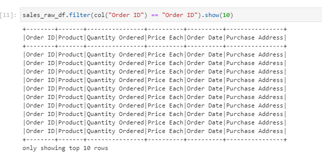
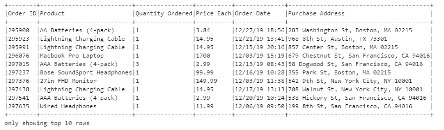
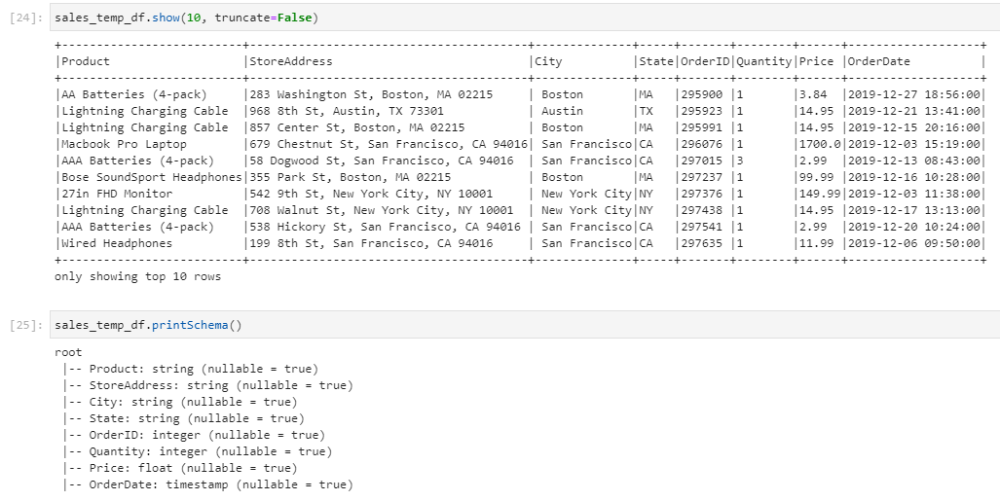
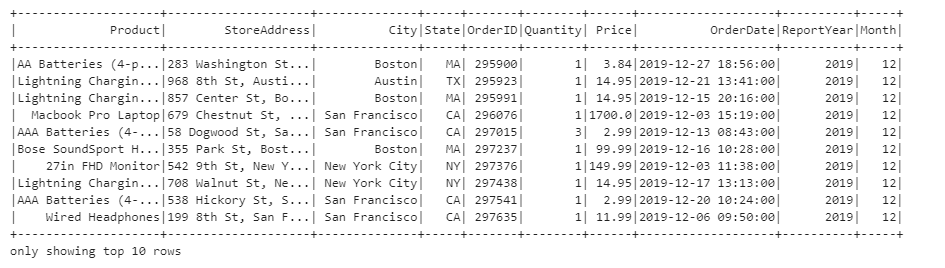
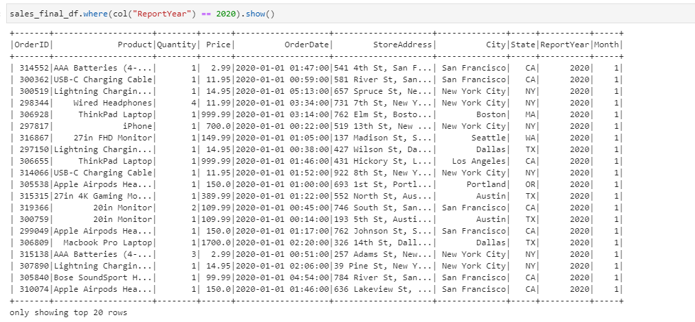

## Challenge Part 2

### Challenge: Part II - Data Preparation and Cleansing

You are required to prepare and clean the data

### 1. Remove bad Records
```
If you query the records from the sales dataframe, you would find bad data as shown in the picture below;
```

<p align="center">
    
</p>

```
If you take a closer look at the above data, the Order ID content is actually equivalent to the Column Name.

This is also true for the rest of the columns and you are required to remove these records from the sales dataframe.
```

### 2. Extract City and State from Address into New Columns
```
Your next task is to extract both the City and State into a new column.


If you have look at the Purchase Address……., you can view the entire purchase address line as components that are separated by a comma delimiter.
```
<p align="center">
    
</p>

```
The city is located as the second element from the address while the street number and name as the 1st element, to get the state, you need to extract the first 2 characters from the 3rd element.
```

### 3. Rename and Change DataTypes
```
Your 3rd task is to rename and change data-types on the data-frame. You are required to change the Order ID and Quantity Ordered into an integer data type, also change the Price column into a Float datatype. There is also a requirement to change the Order Date into a time-stamp and please take notice of the format that is listed below. Part of the requirement is to rename the listed columns as listed below.
```

_**Rename Columns;**_

Order ID -> OrderID

Quantity Ordered -> Quantity

Order Date -> OrderDate

Purchase Address -> StoreAddress

\
&nbsp;

_**Change DataTypes**_

OrderID = Integer

Product = String

Quantity = Integer

Price = Float

OrderDate = Timestamp with Format: "MM/dd/yy HH:mm"

StoreAddress = String

City = String

State = String

<p align="center">
    
</p>

### 4. Add New Columns: ReportYear and Month
```
Your fourth task is to add the Year and Month columns, you can derive the year and month from the OrderDate.
```
<p align="center">
    
</p>

### 5. Find and Remove all rows with any columns
```
Your fifth task to find and remove any null columns. There must be no row that contains nulls on any columns.
```
### 6. Write Final DataFrame to Parquet
```
Your sixth and final task is to rearrange the column order as you can see below and thereafter write your final data frame into the "data/output/sales directory", the parquet file must be partitioned by "ReportYear" followed by "Month".
```
<p align="center">
    
</p>