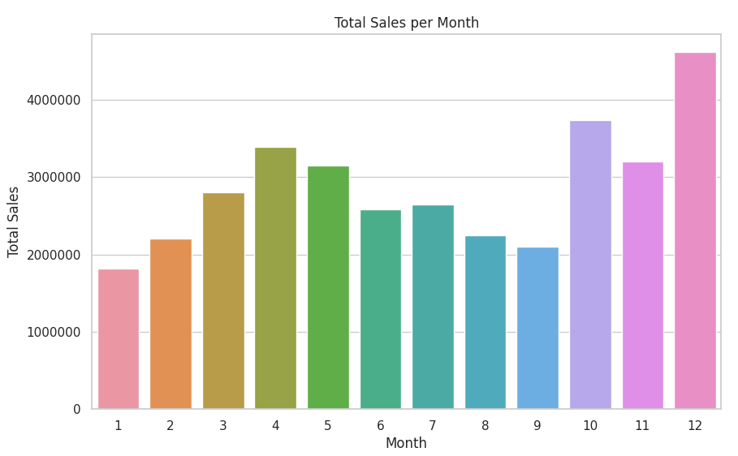
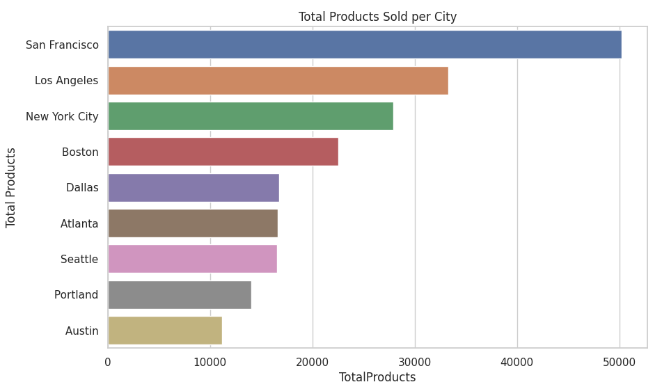
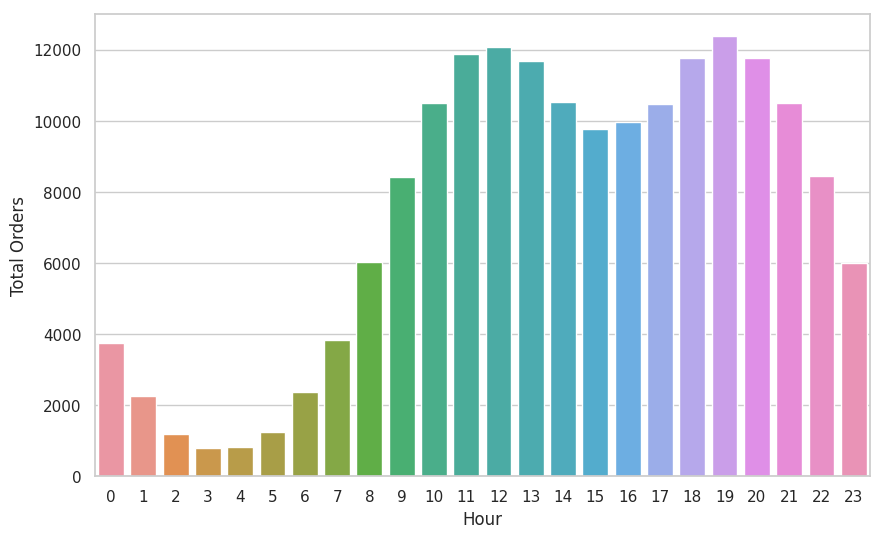
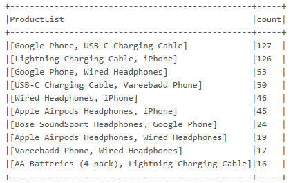

## Challenge Part 3

### The Next Challenge - Sales Analytics

You are required to address business questions pertaining to the Sales Data.

```
Start by renaming the notebook SparkSalesAnalytics to SalesDataPrep, and thereafter create a new notebook and call it SparkSalesAnalytics


Use the new SparkSalesAnalytics notebook to answer the business questions as follows;
```

_**Prerequisite**_
```
Read 2019 Sales Data from the Parquet Directory "data/output/sales"
```

***Question 1:***  What was the best month in terms of sales?

<p align="center">
    
</p>

***Question 2:*** which city actually sold the most products?

<p align="center">
    
</p>

***Question 3:*** What time should we display advertisements to maximize the likelihood of customers buying products?

<p align="center">
    
</p>

***Question 4:*** What products are often sold together in the state “NY”?

<p align="center">
    
</p>